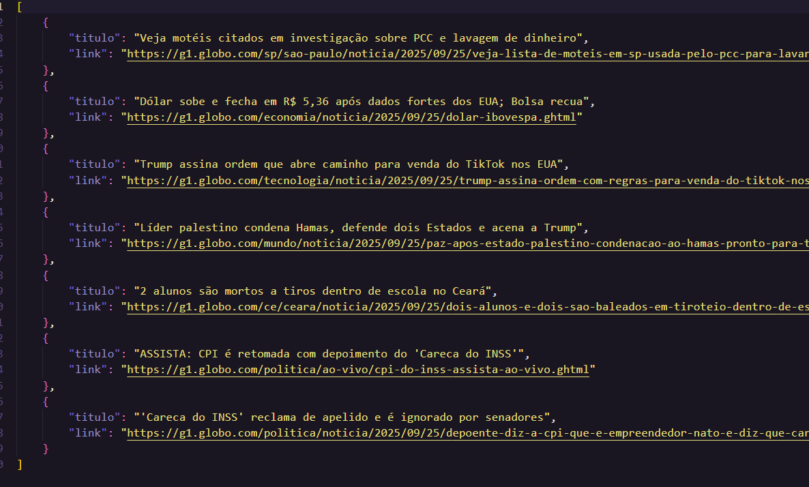

# README - G1 Web Scraper

Este script utiliza a biblioteca Selenium para automatizar a extração de notícias do portal de notícias G1 (g1.globo.com).

## O que o script faz?

1.  Abre o navegador Google Chrome e acessa a página inicial do G1.
2.  Busca pelos blocos de notícias na página.
3.  Extrai o **título** e o **link** de cada notícia encontrada.
4.  Salva todas as informações coletadas em um arquivo chamado `manchetes.json` no mesmo diretório.

## Dependências

Para rodar este script, você precisará de:

1.  **Python 3.x**
2.  **Google Chrome** instalado na sua máquina.
3.  A biblioteca Python **Selenium**:
    ```bash
    pip install selenium
    ```

## Como Rodar

1.  Certifique-se de que todas as dependências acima estão instaladas e configuradas.
2.  Abra um terminal ou prompt de comando nesse diretório.
3.  Execute o seguinte comando:
    ```bash
    python g1_scraper.py
    ```
4.  Aguarde o script finalizar. Ao final, um arquivo `manchetes.json` será criado com os dados extraídos.

