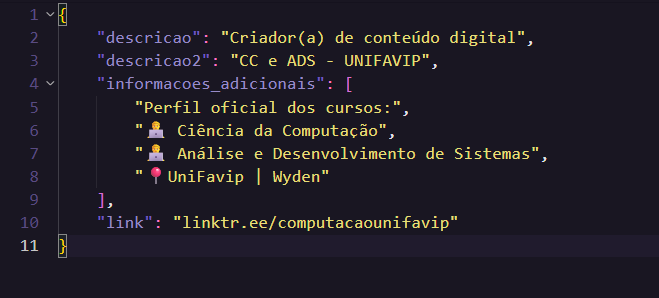

# README - Bot de Login e Extração (Instagram)

Este script é um bot que utiliza Selenium para automatizar o processo de login em uma conta do Instagram, buscar por um perfil específico e extrair informações públicas dessa página.

## O que o script faz?

1.  Abre o navegador Google Chrome.
2.  Acessa a página de login do Instagram.
3.  Preenche os campos de usuário e senha com as credenciais definidas no script e realiza o login.
4.  Busca pelo perfil "computacaounifavip_".
5.  Extrai diversas informações da página do perfil, como descrição, nome, link e outras informações textuais.
6.  Salva todos os dados coletados em um arquivo chamado `dados_completos.json`.

## Dependências

1.  **Python 3.x**
2.  **Google Chrome** instalado.
3.  Bibliotecas Python **Selenium** e **WebDriver Manager**:
    ```bash
    pip install selenium webdriver-manager
    ```
    *(O `webdriver-manager` cuida do download e configuração do ChromeDriver automaticamente.)*

## Configuração Obrigatória

**Antes de rodar**, você precisa editar o arquivo `bot_login.py` e alterar as seguintes linhas com suas credenciais:

```python
# --- CONFIG ---
USER = "SEU_EMAIL_OU_USUARIO_AQUI"
PASS = "SUA_SENHA_AQUI"
# ------- --------
```

**AVISO:** É recomendável usar uma conta de teste ou secundária para automações, a fim de evitar bloqueios ou problemas de segurança com sua conta principal.

## Como Rodar

1.  Instale todas as dependências listadas acima.
2.  Configure suas credenciais dentro do arquivo `bot_login.py`.
3.  Abra um terminal ou prompt de comando no diretório do projeto.
4.  Execute o comando:
    ```bash
    python bot_login.py
    ```
5.  O script irá iniciar, realizar o login e a extração. Ao final, o arquivo `dados_completos.json` será gerado.

